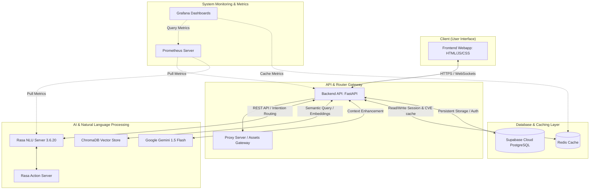

# 🛡️ CyberSec Assistant Platform

[](https://www.python.org/)
[](https://www.docker.com/)
[](https://fastapi.tiangolo.com/)
[](https://rasa.com/)
[](LICENSE)

**CyberSec Assistant** là một nền tảng trợ lý bảo mật toàn diện được hỗ trợ bởi trí tuệ nhân tạo (AI-Powered). Hệ thống tích hợp công nghệ RAG (Retrieval-Augmented Generation), mô hình xử lý ngôn ngữ tự nhiên Rasa NLU và Gemini LLM để cung cấp khả năng tư vấn an toàn thông tin chuyên sâu, phân tích lỗ hổng CVE tự động, kiểm tra độ an toàn của URL và cập nhật tin tức bảo mật theo thời gian thực.

> Nền tảng được tối ưu hóa cho môi trường doanh nghiệp và phục vụ như một danh mục hồ sơ kỹ thuật (GitHub Portfolio) chất lượng cao dành cho các nhà tuyển dụng và chuyên gia bảo mật thông tin.

---

## 📸 Overview & Chatbot UI

Dưới đây là giao diện làm việc chính của **CyberSec Assistant**, giao diện được thiết kế hiện đại, tối giản với chế độ Dark Mode chuẩn Hi-Tech, hỗ trợ hiển thị các chỉ số kiểm tra bảo mật trực quan:


*(Xem thêm demo hoạt động tại mục [Demo & Showcase](#-demo--showcase))*

---

## 🏗️ Architecture Diagram

Hệ thống được thiết kế theo kiến trúc Microservices phân tán, đóng gói hoàn toàn bằng Docker để đảm bảo tính độc lập và khả năng mở rộng. Sơ đồ luồng xử lý yêu cầu dưới đây minh họa cách thức hoạt động của các thành phần:



*Để có phân tích chi tiết hơn về các thành phần và luồng dữ liệu, vui lòng xem [Tài liệu Kiến trúc Hệ thống (docs/architecture.md)](docs/architecture.md).*

---

## ✨ Key Features

*   **🤖 Chatbot Bảo Mật Thông Minh (Hybrid Intention Routing)**:
    Tự động phân loại câu hỏi của người dùng. Với các câu hỏi giao tiếp thông thường hoặc lệnh quản trị, hệ thống định tuyến qua Rasa NLU. Với các câu hỏi chuyên sâu về kỹ thuật bảo mật, Rasa chuyển tiếp yêu cầu đến Gemini LLM kết hợp dữ liệu từ Kho tri thức (RAG).
*   **🔍 Phân Tích Lỗ Hổng CVE (CVE Lookup & Translation)**:
    Tích hợp tìm kiếm thông tin lỗ hổng bảo mật trực tiếp theo mã số CVE từ database, tự động sử dụng LLM dịch thuật thông tin chi tiết sang tiếng Việt và đưa ra khuyến nghị vá lỗi tức thời.
*   **🛡️ Quét Độ An Toàn URL (URL Phishing Scanner)**:
    Tự động phân tích các liên kết (URL) thông qua thuật toán lọc heuristics (phát hiện giả mạo tên miền, ký tự đặc biệt) kết hợp gọi API kiểm tra mẫu độc từ VirusTotal.
*   **📰 Crawler Tin Tức Bảo Mật Tự Động (Security News Aggregator)**:
    Tự động thu thập các tin tức an ninh mạng mới nhất từ các nguồn uy tín như Threatpost, Hacker News và lưu vào database phục vụ việc cập nhật hàng ngày.
*   **📊 Hệ Thống Giám Sát Metrics (Enterprise Monitoring)**:
    Thu thập chỉ số API latency, CPU/RAM, chatbot response rate bằng Prometheus và trực quan hóa trực tiếp thông qua Grafana.

---

## 🛠️ Tech Stack Detail

*   **Ngôn ngữ chính**: **Python (65.1%)**, **JavaScript / HTML / CSS (34.9%)**.
*   **Backend Framework**: **FastAPI** (Python 3.10/3.11), sử dụng cơ chế Async IO đảm bảo hiệu năng cao và độ trễ thấp.
*   **NLU & Chatbot**: **Rasa Open Source 3.6.20** & **Rasa SDK**.
*   **LLM API**: **Google Gemini 1.5 Flash** (sử dụng thư viện `google-genai` mới nhất).
*   **Vector Database (RAG)**: **ChromaDB** phục vụ tìm kiếm ngữ nghĩa (semantic search) trên kho tri thức bảo mật.
*   **Database chính**: **Supabase Cloud (PostgreSQL)** quản lý Users, Chat History, và Security News.
*   **Cache**: **Redis** tăng tốc độ truy vấn tin tức và cache kết quả quét CVE/URL.
*   **Giám sát**: **Prometheus** và **Grafana**.
*   **Đóng gói**: **Docker** & **Docker Compose**.

---

## 🚀 Installation & Setup Guide

Dự án đã được cấu hình hóa toàn bộ bằng Docker Compose. Bạn chỉ cần thực hiện 3 bước đơn giản dưới đây để chạy hệ thống:

### Bước 1: Chuẩn bị môi trường bảo mật
Tạo file `.env` hoặc `.env.local` ở thư mục gốc của dự án và điền các API Key của bạn:
```env
GEMINI_API_KEY=your_gemini_api_key_here
VIRUSTOTAL_API_KEY=your_virustotal_api_key_here
SUPABASE_URL=your_supabase_project_url
SUPABASE_KEY=your_supabase_anon_key
SUPABASE_SERVICE_ROLE_KEY=your_supabase_service_role_key
```

### Bước 2: Huấn luyện chatbot Rasa (Chạy lần đầu)
*   **Trên Windows**:
    ```powershell
    .\scripts\windows\train.bat
    ```
*   **Trên Linux / macOS**:
    ```bash
    docker compose run --rm --no-deps --entrypoint rasa rasa train --config /app/config.yml --domain /app/domain.yml --data /app/data --out /app/models
    ```

### Bước 3: Khởi chạy toàn bộ hệ thống dịch vụ
*   **Trên Windows**:
    ```powershell
    .\scripts\windows\start.bat
    ```
*   **Trên Linux / macOS**:
    ```bash
    docker compose up -d --build
    ```

Sau khi các container báo trạng thái `Healthy`, bạn có thể truy cập hệ thống tại các địa chỉ:
*   👉 **Frontend Interface**: [http://localhost:3000](http://localhost:3000)
*   👉 **Backend FastAPI API Docs**: [http://localhost:8000/docs](http://localhost:8000/docs)
*   👉 **Grafana Dashboard**: [http://localhost:3001](http://localhost:3001) (`admin` / `admin`)

*Hướng dẫn xử lý sự cố chi tiết và cấu hình database riêng vui lòng đọc thêm tại [Hướng dẫn cài đặt chi tiết (hd.md)](hd.md).*

---

## 🎥 Demo & Showcase

Dưới đây là một số hình ảnh động/video minh họa các tính năng thực tế đang hoạt động trên hệ thống:

### 1. Phân tích lỗ hổng CVE dịch sang tiếng Việt:
<!-- [INSERT CVE SCENARIO GIF HERE] -->


### 2. Quét URL chứa mã độc/phishing:
<!-- [INSERT URL SCANNER GIF HERE] -->
*(Ảnh động minh họa chức năng quét liên kết độc hại qua API VirusTotal)*

---

## 💡 Practical Use Cases

1.  **Tra cứu lỗ hổng khẩn cấp**:
    *   *Người dùng hỏi*: "Thông tin chi tiết về lỗi CVE-2021-44228 là gì và làm thế nào để khắc phục?"
    *   *Hệ thống xử lý*: Truy vấn dữ liệu CVE từ database nội bộ hoặc gọi NVD API, dịch nội dung bằng Gemini LLM, sinh ra hướng dẫn vá lỗi Log4j và trả về định dạng markdown dễ đọc.
2.  **Kiểm tra tính an toàn của email chứa liên kết**:
    *   *Người dùng nhập*: `http://secure-bank-login-update.com/reset`
    *   *Hệ thống xử lý*: Phân tích độ dài, kiểm tra giả mạo thương hiệu (typosquatting), gọi API VirusTotal để quét cơ sở dữ liệu mã độc toàn cầu và đưa ra đánh giá phần trăm rủi ro.
3.  **Cập nhật tin tức an ninh mạng**:
    *   *Người dùng*: Nhấn vào mục "Bản tin bảo mật" trên Dashboard.
    *   *Hệ thống xử lý*: Hiển thị danh sách tin tức mới nhất đã được scheduler crawl tự động từ các trang công nghệ uy tín.

---

## ⚡ Challenges & Solutions

### Khó khăn 1: Tương thích phiên bản Rasa và Python 3.12+
*   **Vấn đề**: Thư viện Rasa Open Source (phiên bản 3.6.20) có các thư viện phụ thuộc nghiêm ngặt và chưa tương thích hoàn toàn với Python 3.12+. Cài đặt trực tiếp trên hệ điều hành Windows thường xuyên gây ra lỗi xung đột C-extensions.
*   **Giải pháp**: Container hóa hoàn toàn môi trường chạy Rasa bằng Docker với image base chính thức `rasa/rasa:3.6.20-full` chạy trên nền Python 3.10 cô lập. Các script batch trên Windows chỉ đóng vai trò kích hoạt lệnh Docker Compose mà không cần cài đặt Python cục bộ.

### Khó khăn 2: Xung đột Schema người dùng khi dùng Supabase Cloud
*   **Vấn đề**: Cú pháp SQL migration ban đầu thực hiện `INSERT INTO users` không định rõ schema, dẫn đến Supabase tự động điều hướng vào bảng `auth.users` nội bộ (yêu cầu cấu trúc mật khẩu mã hóa dạng khác) thay vì bảng dữ liệu người dùng của dự án `public.users`, tạo ra lỗi "column password_hash does not exist".
*   **Giải pháp**: Tách biệt rõ ràng SQL migrations thành hai phần. Viết lại script fix [002_fix_users.sql](backend/database/migrations/002_fix_users.sql) chỉ định rõ tiền tố `public.users` và áp dụng cơ chế xác thực JWT bảo mật qua backend trung gian.

*Để xem chi tiết hơn về các thách thức và giải pháp kỹ thuật, xem thêm tại [Tài liệu Thách thức & Giải pháp (docs/challenges_solutions.md)](docs/challenges_solutions.md).*

---

## 🤝 Contributing Guidelines

Mọi đóng góp nhằm hoàn thiện dự án đều được chào đón! Quy trình đóng góp tiêu chuẩn bao gồm:
1. Fork dự án và tạo nhánh mới: `git checkout -b feature/AmazingFeature`.
2. Đọc kỹ và tuân thủ các quy tắc trong [Tài liệu đóng góp (CONTRIBUTING.md)](CONTRIBUTING.md).
3. Đảm bảo chạy qua bộ test kiểm thử cục bộ (`npm test` ở frontend).
4. Commit thay đổi theo định dạng Conventional Commits và tạo Pull Request.

---

## 📄 License

Dự án này được cấp phép dưới quyền sở hữu của **MIT License** - xem tệp [LICENSE](LICENSE) để biết thêm thông tin chi tiết.

---

## 📬 Contact & Support

*   **Tác giả**: Nguyễn Tiến Thành (ntthanh222)
*   **Email**: admin@cybersec.local / thanhnt8821@ut.edu.vn
*   **GitHub**: [@ntthanh222](https://github.com/ntthanh222)
