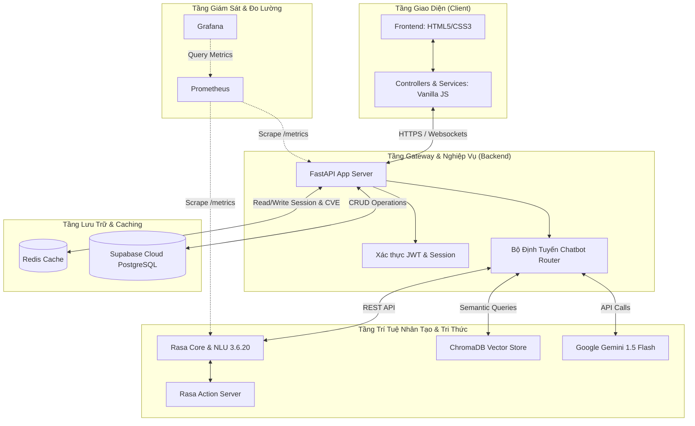
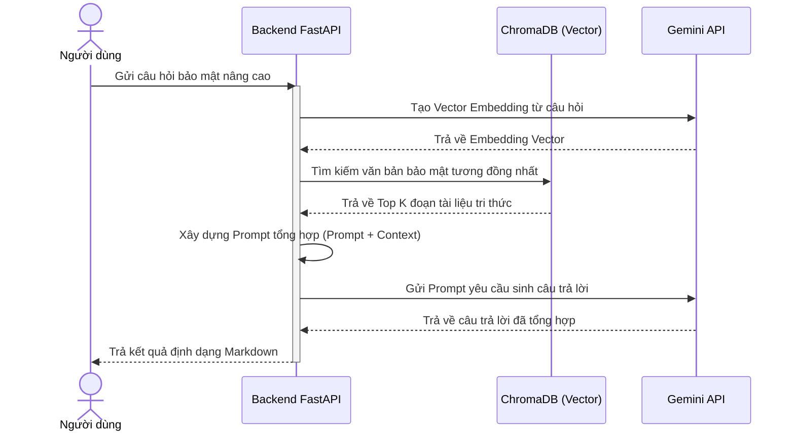

# 🏗️ Kiến Trúc Hệ Thống (System Architecture)

CyberSec Assistant được thiết kế theo mô hình **Microservices** phân tán. Mỗi dịch vụ được container hóa độc lập bằng Docker và giao tiếp với nhau qua các giao thức mạng chuẩn (REST API, WebSockets, và Docker Network).

---

## 1. Sơ Đồ Kiến Trúc Tổng Quan (System Overview)

Dưới đây là mô hình phân tầng chi tiết của hệ thống từ Client đến Database và các thành phần giám sát:

---

## 2. Các Thành Phần Chính (Key Components)

### 2.1. Frontend Web Application (`/frontend`)
- **Vai trò**: Điểm tương tác trực tiếp với người dùng.
- **Công nghệ**: HTML5, Vanilla CSS, Vanilla JavaScript. Thiết kế theo mô hình MVC thu nhỏ (Controllers quản lý hành vi UI, Services thực hiện gửi request lên Backend).
- **Tính năng nổi bật**:
  - Giao diện Chatbot hỗ trợ Markdown rendering và highlight code cho cú pháp hướng dẫn vá lỗi CVE.
  - Dashboard quản trị hiển thị trạng thái crawler, RAG database và người dùng hệ thống.
  - Trang quét mã độc URL và trang tin tức an ninh mạng.

### 2.2. Backend API Server (`/backend`)
- **Vai trò**: Trung tâm xử lý logic nghiệp vụ, xác thực người dùng và định tuyến yêu cầu.
- **Công nghệ**: **FastAPI** (Python 3.10/3.11).
- **Tính năng nổi bật**:
  - Cơ chế Async IO nâng cao hiệu năng xử lý đồng thời.
  - Tích hợp Prometheus metrics exporter (`/metrics`).
  - Hệ thống định tuyến hybrid chatbot thông minh.

### 2.3. Rasa Chatbot Engine (`/rasa`)
- **Vai trò**: Nhận diện ý định (Intent Classifier) và trích xuất thực thể (Entity Extractor) của người dùng.
- **Công nghệ**: **Rasa Open Source 3.6.20** & **Rasa SDK (Action Server)**.
- **Xử lý**:
  - Khi người dùng gửi câu hỏi bảo mật cơ bản (VD: "Chào bạn", "Tài khoản của tôi là gì"), Rasa NLU nhận diện ý định và trả về câu trả lời định sẵn.
  - Khi gặp ý định liên quan đến lỗ hổng hoặc phân tích sâu, Rasa Action Server sẽ chuyển hướng truy vấn sang tầng RAG & Gemini.

### 2.4. RAG & LLM Engine (`/backend/rag`, `/backend/llm`)
- **Vai trò**: Trả lời các truy vấn bảo mật phức tạp dựa trên kho tri thức sẵn có.
- **Công nghệ**: **Google Gemini 1.5 Flash API** & **ChromaDB**.
- **Luồng xử lý RAG (Retrieval-Augmented Generation)**:
  1. Câu hỏi bảo mật của người dùng được chuyển đổi thành vector embedding qua Gemini Embedding API.
  2. ChromaDB thực hiện so khớp vector tương tự để trích xuất các phân đoạn văn bản liên quan nhất từ kho tri thức bảo mật nội bộ.
  3. Kết quả trích xuất được kết hợp cùng câu hỏi gốc thành một prompt nâng cao (augmented prompt).
  4. Prompt này được gửi đến Gemini 1.5 Flash để tổng hợp câu trả lời chính xác, đáng tin cậy và không bị hiện tượng ảo tưởng (hallucination).

### 2.5. Tầng Caching & Storage
- **Supabase Cloud (PostgreSQL)**: Cơ sở dữ liệu chính lưu trữ thông tin phân quyền người dùng, lịch sử chat, tin tức bảo mật đã crawl và logs.
- **Redis Cache**: Lưu trữ cache cho các kết quả tìm kiếm CVE nhằm giảm tải cho NVD API, lưu cache trạng thái Crawler và phiên đăng nhập của người dùng.

---

## 3. Hệ Thống Giám Sát (System Telemetry & Monitoring)

Để đảm bảo hệ thống luôn hoạt động ổn định và phát hiện lỗi sớm:
1. **Prometheus**: Định kỳ kéo dữ liệu metrics từ endpoint `/metrics` của Backend và Rasa Server. Các chỉ số được thu thập bao gồm:
   - Số lượng HTTP Requests theo Method và Status Code.
   - Thời gian phản hồi trung bình của API (API Latency).
   - CPU/RAM sử dụng của các containers.
2. **Grafana**: Kết nối với Prometheus để trực quan hóa dữ liệu thông qua Dashboard. Grafana được cấu hình tài khoản mặc định `admin` / `admin` tại cổng `3001`.
